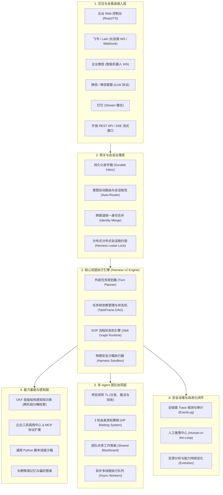
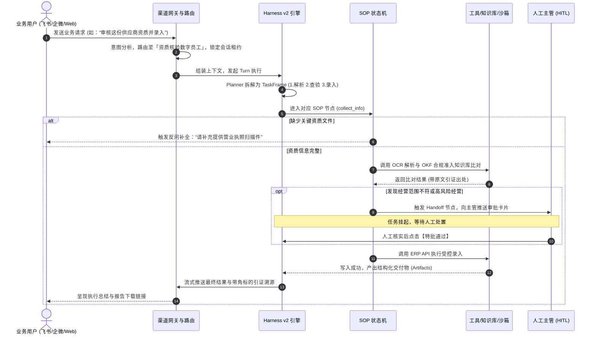
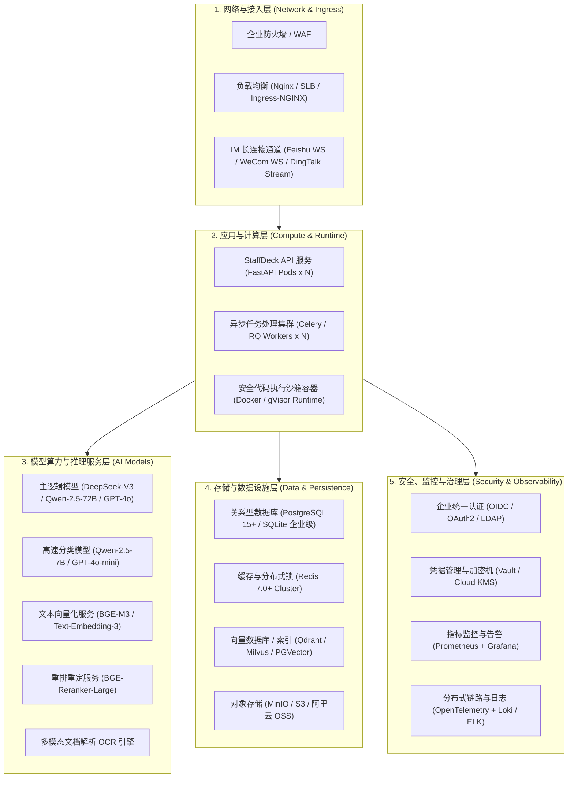
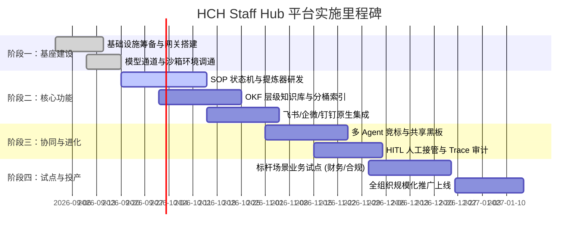

# HCH Staff Hub · 企业级数字员工平台产品需求文档 (PRD)

| 文档版本 | 文档状态 | 撰写日期 | 适用系统 | 密级 |
| :--- | :--- | :--- | :--- | :--- |
| **v1.0.0** | 待评审 (Ready for Review) | 2026-09-02 | HCH Staff Hub 数字员工中枢平台 | 企业内部公开 |

---

## 目录

- [一、 项目背景与产品定位](#一-项目背景与产品定位)
  - [1.1 业务背景与行业痛点](#11-业务背景与行业痛点)
  - [1.2 产品使命与核心定位](#12-产品使命与核心定位)
  - [1.3 目标用户与角色定义](#13-目标用户与角色定义)
  - [1.4 典型业务应用场景](#14-典型业务应用场景)
- [二、 产品目标与核心衡量指标 (KPIs / OKRs)](#二-产品目标与核心衡量指标-kpis--okrs)
  - [2.1 业务目标](#21-业务目标)
  - [2.2 技术与运行指标](#22-技术与运行指标)
- [三、 总体产品架构与业务流转](#三-总体产品架构与业务流转)
  - [3.1 产品逻辑架构图](#31-产品逻辑架构图)
  - [3.2 典型端到端业务流转图](#32-典型端到端业务流转图)
- [四、 核心功能需求规格说明 (Functional Requirements)](#四-核心功能需求规格说明-functional-requirements)
  - [4.1 员工档案与身份治理模块 (Digital Identity & Persona)](#41-员工档案与身份治理模块-digital-identity--persona)
  - [4.2 状态机流程编排模块 (SOP Flow & Distiller)](#42-状态机流程编排模块-sop-flow--distiller)
  - [4.3 层级结构化知识检索模块 (Hierarchical OKF RAG)](#43-层级结构化知识检索模块-hierarchical-okf-rag)
  - [4.4 安全沙箱与工具集成模块 (Harness Sandbox & MCP)](#44-安全沙箱与工具集成模块-harness-sandbox--mcp)
  - [4.5 多 Agent 团队协同模块 (Team Leader, Bidding & Blackboard)](#45-多-agent-团队协同模块-team-leader-bidding--blackboard)
  - [4.6 企业级全渠道接入与智能路由模块 (Omni-channel & Routing)](#46-企业级全渠道接入与智能路由模块-omni-channel--routing)
  - [4.7 人在回路与异常接管模块 (Human-in-the-Loop & Handoff)](#47-人在回路与异常接管模块-human-in-the-loop--handoff)
  - [4.8 全链路观测与闭环演进模块 (Observability, Feedback & Evolution)](#48-全链路观测与闭环演进模块-observability-feedback--evolution)
- [五、 非功能性需求 (NFRs)](#五-非功能性需求-nfrs)
  - [5.1 性能与高可用要求](#51-性能与高可用要求)
  - [5.2 安全合规与权限隔离](#52-安全合规与权限隔离)
  - [5.3 数据一致性与灾备能力](#53-数据一致性与灾备能力)
- [六、 重点：基础设施需求与配置清单 (Infrastructure Checklist)](#六-重点基础设施需求与配置清单-infrastructure-checklist)
  - [6.1 基础设施全景拓扑图](#61-基础设施全景拓扑图)
  - [6.2 详细基础设施分类清单 (Checklist 表格)](#62-详细基础设施分类清单-checklist-表格)
  - [6.3 部署形态与规格选型建议 (PoC版 / 标准生产版 / 大规模高可用集群)](#63-部署形态与规格选型建议-poc版--标准生产版--大规模高可用集群)
  - [6.4 基础设施高可用与容灾方案](#64-基础设施高可用与容灾方案)
- [七、 实施里程碑与发布计划](#七-实施里程碑与发布计划)
- [八、 风险评估与应对策略](#八-风险评估与应对策略)

---

## 一、 项目背景与产品定位

### 1.1 业务背景与行业痛点

当前企业推进智能化转型时，大语言模型（LLM）的应用普遍停留在“智能问答客服”或“玩具级个人 Copilot”阶段，在落地到企业严肃核心业务时面临严峻挑战：

1. **幻觉与不确定性**：概率型生成的大模型无法保证 100% 遵从复杂业务规章，在合规、财务、合同、技术运维等场景下不可控。
2. **业务流程脱节**：通用 Agent 缺乏强流程约束，无法保证按照固定步骤（SOP）收集信息、多步校验与审批。
3. **“动嘴不动手”**：传统问答机器人停留在给出建议，无法安全调用内部 ERP、CRM、OA 等企业核心系统执行物理操作。
4. **经验资产流失**：优秀员工的业务经验与排错技巧存在于个人脑中，离职即流失，缺乏工程化工具将“隐性经验”沉淀为“数字资产”。
5. **协同与边界混乱**：单 Agent 难以处理复合复杂目标；多 Agent 缺乏分工认领标准，容易造成执行冲突或长上下文雪崩。

### 1.2 产品使命与核心定位

**HCH Staff Hub** 旨在打造新一代**企业级数字员工构建与协同中枢平台**。
产品定位为**“数字生产力基础设施”**，通过引入**有限状态机强约束、双层任务帧规划调度、层级结构化知识索引、安全代码与工具沙箱、多 Agent 竞标协同机制以及人在回路（HITL）机制**，将业务专家的隐性经验固化为拥有工号、岗位、能力边界和可交付标准的数字员工，实现严肃业务的高可靠端到端交付。

### 1.3 目标用户与角色定义

| 角色类型 | 典型代表 | 核心关注点与诉求 |
| :--- | :--- | :--- |
| **最终业务用户 (End User)** | 销售、客服、财务、一线业务员 | 在飞书/企微/微信等熟悉工具中与数字员工对话，自动完成查数、制单、审核与业务流转。 |
| **业务专家 / 流程设计师 (Creator)** | 业务骨干、部门主管、合规经理 | 无需编写复杂代码，通过自然语言对话式提炼 SOP 状态机，配置专属业务知识库与工具规则。 |
| **项目领导 / 团队主管 (TL / Manager)** | 项目经理、调度负责人 | 下发复合大任务，观测多员工竞标、认领、执行与共享黑板进度，进行交付物质量验收与改判。 |
| **系统管理员 (Sysadmin / Platform Owner)** | 企业 IT 负责人、运维架构师 | 模型接口纳管、权限与多租户隔离、渠道凭证管理、基础设施资源规划、审计 Trace 与合规监管。 |

### 1.4 典型业务应用场景

- **场景 A：智能财务报销与初审员**：通过企微接收发票与报销单，执行合规核对 SOP，自动比对差旅标准，调用 ERP 查询借款余额，发现异常主动提交人工财务复审。
- **场景 B：企业法务合同合规审查员**：基于 OKF 层级知识库导航法律法规，逐条比对合同条款并生成原子级引证报告，标记风险点并输出修改建议。
- **场景 C：跨部门多智能体调研团队**：业务负责人向“研究团队”下发宏观需求（如海外某市场准入分析），Team Leader 拆解任务，多位专业员工通过“3轮血条竞标赛制”认领任务，利用共享黑板沉淀结论，产出综合交付报告。

---

## 二、 产品目标与核心衡量指标 (KPIs / OKRs)

### 2.1 业务目标

1. **核心流程自动化率**：高频重复性业务（如报销初审、工单派发、基础合规初查）实现 **≥ 75%** 的全流程无人工介入交付。
2. **人均业务处理效能**：单笔业务平均处理时长缩短 **60% 以上**，跨系统查询与数据整合效率提升 **3 倍**。
3. **经验显性化沉淀**：业务骨干编制 SOP 平均耗时控制在 **30 分钟以内**（通过自然语言提炼器引导完成）。
4. **风险拦截率**：高风险操作（涉及金额、权限变更、公章外发）**100% 触发 HITL 人工二次审核**。

### 2.2 技术与运行指标

| 指标分类 | 具体指标项 | 目标阈值 |
| :--- | :--- | :--- |
| **时延与性能** | 首字响应时延 (TTFT, Time-to-First-Token) | `< 1.2 秒`（流式输出） |
| | SOP 动作节点平均调度时延 | `< 400 毫秒`（不含外部第三方 API 耗时） |
| **高可用与稳定性** | 平台整体系统可用性 (SLA) | `≥ 99.9%` |
| | 会话幂等防重与故障自愈率 | `100%`（网络抖动无重复副作用） |
| **准确率与合规** | 知识库原子引证准确率 (Citation Precision) | `≥ 95%`（每一处结论必须准确索引到文档章节） |
| | 任务帧（TaskFrame）死循环阻断率 | `100%`（受单轮最大动作预算硬约束） |

---

## 三、 总体产品架构与业务流转

### 3.1 产品逻辑架构图

### 3.2 典型端到端业务流转图

---

## 四、 核心功能需求规格说明 (Functional Requirements)

### 4.1 员工档案与身份治理模块 (Digital Identity & Persona)

- **功能描述**：提供完整的数字员工全生命周期管理，从定义、构建、授权到发布。
- **具体要求**：
  1. **档案要素**：具备岗位名称、工号、头像、职责描述、服务风格（语气/禁忌词）、所属部门与责任人。
  2. **能力挂载**：支持以搭积木方式绑定 4 类能力资产：SOP 技能、通用脚本技能、业务工具/MCP、OKF 知识库。
  3. **权限与可见性**：支持“私有开发中”、“部门内共享”和“发布至企业员工广场（只读模板）”；普通成员仅能克隆广场模板为自有实例进行个性化配置，不可篡改原始模板。
  4. **运行密钥管理**：支持为单个员工生成专有 API 密钥（可调用对话与查询产物，但不可修改能力配置），支持账号级全局密钥。

### 4.2 状态机流程编排模块 (SOP Flow & Distiller)

- **功能描述**：为数字员工提供确定性业务履约能力，将经验固化为有向图有限状态机。
- **具体要求**：
  1. **自然语言提炼器（Skill Distiller）**：业务专家输入一段工作说明书或与 AI 对话，AI 自动逆向提炼并生成包含开始节点、收集节点、动作节点、终止节点的规范 SOP 草稿。
  2. **节点类型支持**：
     - `collect_info`：定义必填与选填槽位（Slots），支持正则表达式和语义校验；槽位缺失时自动发起追问。
     - `action`：动作执行节点，限定节点内可调用的工具集合（`capability_refs`），模型无法跨节点偷跑其他工具。
     - `sub_sop`：子流程嵌套，支持大型复杂流程的模块化复用与跨流程调用。
     - `handoff`：人工接管节点，定义转人工的触发规则与责任人通知策略。
  3. **打断与恢复（Interruption Policy）**：当用户在流程中穿插闲聊或询问其他问题时，支持临时插话响应并在之后精准恢复当前流程上下文。

### 4.3 层级结构化知识检索模块 (Hierarchical OKF RAG)

- **功能描述**：解决朴素向量切割（Chunking）导致的指代模糊与上下文丢失问题。
- **具体要求**：
  1. **OKF（Open Knowledge Format）解析**：自动解析 PDF、Word、Markdown 文档的目录层级、章节标题、页码、段落与图表，生成层级概念树（Concepts）。
  2. **两阶段分桶检索**：
     - 阶段 1（粗筛）：根据用户问题，先判断归属于哪个业务分桶（如：差旅桶、采购桶）及具体章节；
     - 阶段 2（细排）：在锁定章节内提取原子规则与段落文本。
  3. **原子级精确引证（Atomic Citations）**：回答中附带引证角标（如 `[1]`），点击可展开查阅原始文档名、章节位置、段落摘录，彻底消除模型幻觉并满足审计需要。

### 4.4 安全沙箱与工具集成模块 (Harness Sandbox & MCP)

- **功能描述**：为数字员工提供执行物理操作的能力，同时提供严格的安全边界。
- **具体要求**：
  1. **Harness 工作区沙箱**：为每个任务或会话分配独立的虚拟文件目录，支持文件上传、临时产物（CSV/Excel/PDF）生成与安全清理。
  2. **受限脚本执行**：支持运行受控的 Python 代码（通用技能），严格限制执行超时（如不超过 60 秒）、内存与磁盘输出字节配额（`max_result_bytes`），屏蔽危险系统调用。
  3. **MCP（Model Context Protocol）与 HTTP 工具扩展**：支持基于标准化 MCP 协议加载外部服务；支持配置自定义 OpenAPI/REST 工具，集成 Bearer Token/API Key 加密安全存储。

### 4.5 多 Agent 团队协同模块 (Team Leader, Bidding & Blackboard)

- **功能描述**：实现多位数字员工在宏观目标下的自组织、竞标认领与知识共享。
- **具体要求**：
  1. **项目领导（TL）机制**：由指定专家级 Agent 担任 TL，负责拆解复杂目标并向团队任务池派发。
  2. **3 轮血条竞标赛制（HP Bidding）**：
     - 当任务候选员工 ≥ 2 时触发竞标；
     - Round 1 方案陈述，Round 2-3 方案反驳；每轮由 TL 进行 0-10 分轻量打分，低于标准的员工扣减生命值（HP），生命值归零淘汰；
     - 最终存活者中标并自动获取任务会话，全流程留痕可审计。
  3. **团队共享黑板（Shared Blackboard）**：
     - 提供团队内的全局事实存储，支持通过轻量入库流水线（解析 → 去重规范化 → 结构化写入 → 建立引用链接）；
     - 成员只按 Top-K 读取最相关先验知识，彻底避免跨员工长对话上下文爆炸。

### 4.6 企业级全渠道接入与智能路由模块 (Omni-channel & Routing)

- **功能描述**：让数字员工触达员工日常工作的全域触点。
- **具体要求**：
  1. **渠道连接器**：
     - 飞书（Feishu/Lark）：支持长连接 WebSocket 与 Webhook，支持飞书消息卡片排版。
     - 企业微信（WeCom）：智能机器人长连接，Markdown 语法兼容渲染。
     - 微信个人号 / 微信客服：iLink 协议支持，满足内外客户沟通需求。
     - 钉钉（DingTalk）：Stream 模式，安全无需公网暴露接收端口。
  2. **意图智能路由**：单个渠道支持挂载多名不同职责的数字员工，接收到消息后通过快速轻量分类器分发至最合适员工。
  3. **会话粘性保护**：当员工正在执行 SOP 流程或处于人工介入保护期内，自动提升切换阈值，避免上下文被意外插话打断。
  4. **跨端身份绑定**：支持用户在微信/企微内输入 `/绑定 <code>` 将外部账号与平台身份打通，实现全渠道记忆与历史同步。

### 4.7 人在回路与异常接管模块 (Human-in-the-Loop & Handoff)

- **功能描述**：保障关键业务的安全性与业务兜底能力。
- **具体要求**：
  1. **无缝人工接管**：SOP 走到 `handoff` 节点或发生不可恢复异常时，系统生成接管单并自动向指定责任人推送提醒（包含历史上下文摘要与推荐操作）。
  2. **双向状态保活**：人工处理完毕后，可选择“直接完结任务”或“输入批示后交还数字员工继续执行”。

### 4.8 全链路观测与闭环演进模块 (Observability, Feedback & Evolution)

- **功能描述**：提供透明审计与自我进化的数据飞轮。
- **具体要求**：
  1. **全链路实时 Trace**：以可视化瀑布流呈现单轮对话的 Planner 决策、Router 分流、SOP 节点流转、Tool 调用入参/出参、耗时与 Token 消耗。
  2. **用户反馈收集**：提供每条回答的点赞、点踩、错误分类标签与纠错文本输入。
  3. **自动演进分析（Evolution Engine）**：定期离线聚合负向反馈与失败链路，智能分析 SOP 节点瓶颈或知识库盲区，生成改进建议（PR 形式），由管理员一键审批合并。

---

## 五、 非功能性需求 (NFRs)

### 5.1 性能与高可用要求
- **并发能力**：单节点支持并发执行不少于 50 个活跃 Agent 会话；任务队列支持水平扩展。
- **响应延迟**：模型端首字流式输出延迟（TTFT）≤ 1.2s，内部状态机流转控制开销 ≤ 50ms。
- **高可用架构**：服务采用无状态应用设计，支持多副本部署；单机故障可在 30 秒内完成租约漂移与任务恢复。

### 5.2 安全合规与权限隔离
- **敏感凭据加密**：所有外部渠道凭证、企业 API Key、模型密钥均采用 AES-256 / Fernet 加密存储，严禁接口回显明文。
- **多租户数据隔离**：数据库层面支持租户 ID 强制逻辑隔离或分库隔离；跨租户访问直接阻断并记录安全告警。
- **提示词注入防御**：对外部入参和附件进行安全清洗，隔离系统指令与用户数据域。

### 5.3 数据一致性与灾备能力
- **幂等性保障**：入站消息采用唯一消息 ID 幂等去重（`Durable Inbox`），杜绝因网络重试导致多次划款或重复制单。
- **数据容灾**：核心元数据支持每日自动备份；支持断点任务快照持久化，服务器重启后未完成任务可自动重拉或妥善标记失败。

---

## 六、 重点：基础设施需求与配置清单 (Infrastructure Checklist)

为了支撑企业级数字员工的低延迟规划、强约束状态机、沙箱隔离以及多渠道长连接并发，需要配置以下六个维度的基础设施。

### 6.1 基础设施全景拓扑图

---

### 6.2 详细基础设施分类清单 (Checklist 表格)

以下为平台建设必须筹备和核验的**软硬件基础设施清单**：

| 基础设施分类 | 组件名称 / 技术选型 | 推荐版本 / 规格 | 核心作用与使用场景 | 必需级别 |
| :--- | :--- | :--- | :--- | :--- |
| **一、计算与运行时** | **API 应用服务器** | 8 Core CPU, 16GB+ RAM（多节点） | 承载 FastAPI 网关、REST/SSE 端点、SOP 状态机调度、多 Agent 竞标协调。 | **必须** |
| | **异步任务 Worker** | 8 Core CPU, 16GB+ RAM | 消费后台长任务、定时巡检任务、团队异步线程、OKF 知识导入流水线。 | **必须** |
| | **安全执行沙箱环境** | Docker / gVisor / 受限容器池 | 隔离执行 Python 通用技能、文件操作与文档导出，限制网络与磁盘开销。 | **必须** |
| **二、AI 模型推理** | **主任务/规划大模型** | DeepSeek-V3 / Qwen-2.5-72B / Claude 3.5 / GPT-4o | 负责复杂需求拆解（Planner）、SOP 提炼、复杂报告撰写、TL 竞标裁决。 | **必须** |
| | **轻量高速路由模型** | Qwen-2.5-7B / Llama-3-8B / GPT-4o-mini | 负责渠道意图快速分类分发（Auto-route）、信息槽位轻量提取、打分仲裁。 | **必须** |
| | **向量模型 (Embedding)** | BGE-M3 / OpenAI text-embedding-3-small | 将 OKF 文档章节、摘要、长期记忆向量化，支持多语言与长文本混合检索。 | **必须** |
| | **重排序模型 (Reranker)**| BGE-Reranker-v2-m3 / Cohere Rerank | 在 OKF 知识两阶段检索中执行细排，大幅提升原子引证精度。 | **推荐** |
| | **多模态解析 / OCR** | PaddleOCR / Docling / 开源多模态大模型 | 解析发票、营业执照、PDF 合同等非结构化图像与表格。 | **按需** |
| **三、存储与数据库** | **核心关系型数据库** | PostgreSQL 15+ / 高可用主从架构 | 存储员工档案、SOP 流程图、TaskFrame 状态表、审计流水、用户权限。 | **必须** |
| | **分布式缓存与租约锁** | Redis 7.0+（单实例或 Sentinel/Cluster） | 承载 HarnessSessionLease 租约分布式锁、消息幂等去重、会话粘性缓存。 | **必须** |
| | **向量索引存储** | PGVector 插件 / Qdrant / Milvus | 存储知识库分块向量与长期记忆情境向量，支持混合检索（BM25 + Dense）。 | **必须** |
| | **对象存储 (Object Store)**| MinIO / 阿里云 OSS / AWS S3 | 存储知识库原始文档、聊天附件、临时文件、数字员工最终输出的产物包。 | **必须** |
| **四、网络与通信** | **反向代理与网关** | Nginx / OpenResty / 云 SLB | 承载 HTTPS 证书卸载、SSE 长连接转发、负载均衡与限流防刷。 | **必须** |
| | **企业专线 / 域名** | 具备有效公网解析域名与独立 IP | 接收外部渠道回调；企微/飞书等开放平台需要配置可信域名与安全白名单。 | **必须** |
| | **WebSocket 长连接支持** | HTTP/1.1 Upgrade / WS 网关 | 保持飞书与企业微信智能机器人的长连接，无需公网开放接收端。 | **必须** |
| **五、安全与权限** | **密钥管理设施 (KMS)** | HashiCorp Vault / 本地 Fernet 派生密钥 | 加密存储渠道 AppSecret、外部系统 API 密钥、数据库连接串。 | **必须** |
| | **企业身份认证 (SSO)** | Keycloak / Authing / LDAP / OIDC | 支持企业统一账号单点登录，与企业 HR 组织架构同步。 | **推荐** |
| **六、监控与可观测** | **指标监控与告警** | Prometheus + Grafana | 监控 CPU/内存、模型调用 QPS、错误率、任务排队延迟并触发告警。 | **推荐** |
| | **链路追踪与日志** | OpenTelemetry + Jaeger / Loki / ELK | 收集全链路 Agent 思考流、工具调用跨度、模型响应耗时，支撑审计定位。 | **必须** |

---

### 6.3 部署形态与规格选型建议 (PoC版 / 标准生产版 / 大规模高可用集群)

根据企业当前建设阶段，推荐选择如下对应配置规模：

#### 方案 A：PoC 验证与部门级试用版（50人以内，快速验证）
- **适用场景**：业务可行性验证、单部门（如财务部）闭环试点、轻量场景。
- **架构特点**：单机极简交付，所有核心中间件可共用或采用轻量替代品。
- **硬件配置**：
  - 1 台 8 Core CPU, 32GB RAM 云主机（Ubuntu 22.04 LTS 或 Linux 容器）；
  - 100GB 系统盘 + 200GB 数据盘（SSD）；
- **基础软件**：
  - PostgreSQL 15 + Redis 7（Docker 容器化部署）；
  - 本地文件系统模拟对象存储；
  - 模型直接采用公有云商业 API（如 DeepSeek 官方 API 或 Azure OpenAI）。

#### 方案 B：企业标准生产版（500~2000人规模，典型推荐）
- **适用场景**：多部门协同、多数字员工挂载、企业微信/飞书全员开放、高可靠保障。
- **架构特点**：前后端解耦、计算与存储分离、核心服务双副本。
- **硬件与节点清单**：
  - **应用与 Worker 节点**：2 台 8 Core CPU, 16GB RAM 主机（负载均衡双活）；
  - **沙箱隔离节点**：1 台 8 Core CPU, 16GB RAM 主机（专用容器隔离执行环境）；
  - **数据库服务**：云托管 PostgreSQL 15（4 Core 16GB，高可用主备）；
  - **缓存与租约**：云托管 Redis 7（8GB 主从版）；
  - **对象存储**：MinIO 集群或企业云 OSS（1TB 容量起步）；
  - **模型接入**：外部专属通道商用模型 API，或私有化部署 1 台配备 4× NVIDIA A10/A800 显卡的专用推理机。

#### 方案 C：集团级高可用弹性集群版（万人以上 / 核心生产线）
- **适用场景**：全集团智能化中枢、核心业务 7×24h 连续运转、多租户强隔离。
- **架构特点**：全容器化 Kubernetes（K8s）编排，支持 HPA 弹性伸缩与多可用区容灾。
- **节点规格**：
  - **K8s 工作节点**：至少 5~8 台 16 Core, 64GB 节点（区分 Ingress、App、Worker、Sandbox 节点池）；
  - **专用推理集群**：多台 8× H800 / A800 算力机，部署 vLLM / SGLang 推理框架，支持本地推理与热备降级；
  - **分布式向量库**：独立部署的 Milvus / Qdrant 分布式集群；
  - **专线网络**：双路 BGP 公网专线 + VPC 内部高速互联网络（≥ 10Gbps）。

---

### 6.4 基础设施高可用与容灾方案

1. **分布式租约锁保障状态一致性**：
   - 当某台应用服务器宕机时，Redis 租约锁在超时（如 30 秒）后自动释放，其他健康节点自动接管未完结的 `TaskFrame`，避免业务悬挂。
2. **模型调用多路故障转移（Failover）**：
   - 基础设施网关层配置模型回退规则：当主模型（如 DeepSeek-V3）遇到网络抖动或限流 429 时，在 500ms 内无缝重试降级切换至备用模型提供商或备选模型，业务端无感知。
3. **数据冷热分离与定时归档**：
   - 审计日志与全链路 Trace 每月产生海量事件，系统自动将 90 天以上的冷数据归档至对象存储，保持关系型数据库轻量高效。

---

## 七、 实施里程碑与发布计划

- **M1 (MVP 阶段 - 6周)**：完成单员工构建、SOP 状态机编排、企业微信/飞书打通，支持单流程封闭测试。
- **M2 (协同与专业化 - 6周)**：上线 OKF 层级知识库、多 Agent 团队竞标协同、共享黑板、全链路可观测 Trace。
- **M3 (全面投产与自进化 - 4周)**：对接企业 SSO、部署完整监控告警系统，上线反馈自进化引擎与全量业务试点。

---

## 八、 风险评估与应对策略

| 风险类别 | 风险表现 | 严重程度 | 应对与缓解措施 |
| :--- | :--- | :--- | :--- |
| **模型稳定性风险** | 大模型 API 限流 (429) 或网络连接超时中断。 | **高** | 部署网关级动态重试与双供应商多活热备；客户端与 IM 侧实现断线友好提醒与排队。 |
| **业务逻辑失控风险** | 大模型未按照业务规章操作，产生误判或错误输入。 | **极高** | 强制执行状态机槽位校验；关键高危节点前置配置 `handoff` 节点，强制人类二次审批。 |
| **脚本沙箱逃逸风险** | 恶意构造的 Python 脚本突破文件限制，窃取数据或破坏宿主机。 | **高** | 采用 Docker / gVisor 容器沙箱强隔离，非 root 运行，切断危险外部网络访问，限制 CPU/RAM/磁盘。 |
| **渠道频率限制风险** | 频繁向企微或飞书推送消息被平台封禁或流控。 | **中** | 引入出站队列（Outbox Queue）削峰填谷，实行退避重试算法，遵循各大 IM 平台的频率规范。 |
| **组织适应与习惯** | 业务人员习惯原有手工流程，不信任或排斥数字员工。 | **中** | 采用“渐进式接管”策略，初期默认以“协助建议”为主由人工确认，待信任建立后逐步提高自动化比例。 |

---

> 📌 **文档批准签发**
> 
> - **产品负责人 (Product Lead)**：__________________　　日期：______年___月___日
> - **技术架构师 (Chief Architect)**：__________________　　日期：______年___月___日
> - **基础设施运维负责人 (Ops Lead)**：__________________　　日期：______年___月___日

