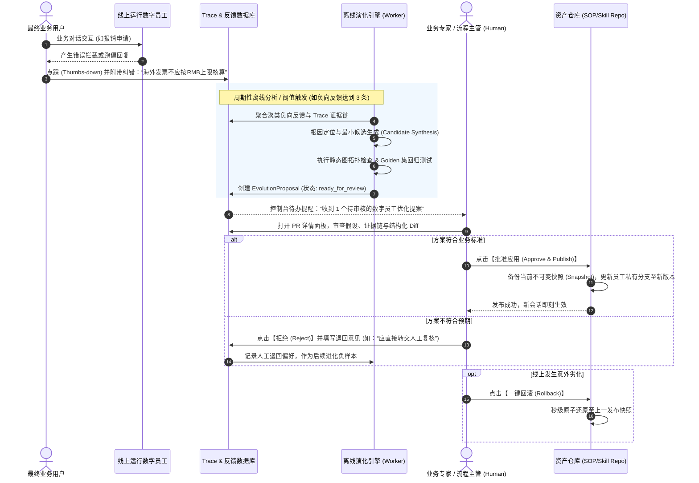

# Agent 持续优化中的“PR 机制”全解与实践指南
> **文档定位**：系统性阐述企业级数字员工（Digital Employee / Agent）如何借鉴现代软件工程的 **Pull Request (PR / 合并提案)** 机制，构建**“用户反馈 → 根因分析 → 候选生成 → 回测验证 → 人工审批 → 原子生效 → 故障回滚”**的受控自进化闭环。

---

## 目录

- [一、 为什么 Agent 优化必须引入“PR 机制”？](#一-为什么-agent-优化必须引入pr-机制)
  - [1.1 传统 Agent“自由进化”的灾难陷阱](#11-传统-agent自由进化的灾难陷阱)
  - [1.2 软件代码 PR vs Agent 资产 PR 对比](#12-软件代码-pr-vs-agent-资产-pr-对比)
- [二、 Agent PR 的具体形态与数据结构 (Schema)](#二-agent-pr-的具体形态与数据结构-schema)
  - [2.1 PR 的六大核心要素](#21-pr-的六大核心要素)
  - [2.2 完整的 PR 数据结构示例 (JSON Schema)](#22-完整的-pr-数据结构示例-json-schema)
  - [2.3 结构化 Diff 对比呈现形态](#23-结构化-diff-对比呈现形态)
- [三、 Agent 优化中的 PR 端到端闭环应用流程](#三-agent-优化中的-pr-端到端闭环应用流程)
  - [3.1 闭环运转全景时序图](#31-闭环运转全景时序图)
  - [3.2 步骤 1：异常信号捕获与聚类 (Signal Capture)](#32-步骤-1异常信号捕获与聚类-signal-capture)
  - [3.3 步骤 2：生成最小修改候选 (Candidate Synthesis)](#33-步骤-2生成最小修改候选-candidate-synthesis)
  - [3.4 步骤 3：静态规则与回测套件验证 (Evaluation Gate)](#34-步骤-3静态规则与回测套件验证-evaluation-gate)
  - [3.5 步骤 4：人类业务专家审核与裁决 (Human Review)](#35-步骤-4人类业务专家审核与裁决-human-review)
  - [3.6 步骤 5：私有分支应用与渐进发布 (Branching & Deploy)](#36-步骤-5私有分支应用与渐进发布-branching--deploy)
  - [3.7 步骤 6：版本快照与秒级原子回滚 (Rollback)](#37-步骤-6版本快照与秒级原子回滚-rollback)
- [四、 典型实战案例：财务报销初审员工的 PR 优化全过程](#四-典型实战案例财务报销初审员工的-pr-优化全过程)
  - [4.1 故障起因：真实用户差评与审计告警](#41-故障起因真实用户差评与审计告警)
  - [4.2 自动生成的 PR 内容实录](#42-自动生成的-pr-内容实录)
  - [4.3 专家审核、合并及成效验证](#43-专家审核合并及成效验证)
- [五、 Agent PR 机制的核心安全准则与落地规范](#五-agent-pr-机制的核心安全准则与落地规范)

---

## 一、 为什么 Agent 优化必须引入“PR 机制”？

### 1.1 传统 Agent“自由进化”的灾难陷阱

在早期的生成式 AI 或自主智能体（AutoGPT 类）理念中，很多人推崇“全自动自反思、自修改 Prompt 并实时更新生效”。但在严肃的企业生产环境中，这种未加约束的“自由自修改”会带来毁灭性的灾难：

1. **灾难性遗忘与回归（Catastrophic Forgetting）**：为了迎合某一个用户的特殊输入调整了 Prompt 或流程，导致此前测试通过的 90% 经典标准业务用例全部跑偏。
2. **越权与提示词注入污染（Prompt Injection Vulnerability）**：恶意用户或异常输入通过反馈通道污染反思引擎，诱导 Agent 篡改自身 SOP 移除鉴权或人工审批节点，造成重大合规事故。
3. **变更不可追溯（Lack of Traceability）**：线上 Agent 的输出行为突然改变，业务主管和技术团队无法查明“谁在什么时间因为什么原因修改了哪一行规则”。
4. **缺乏原子回滚能力（No Rollback Safety Net）**：一旦改错，无法瞬间退回到上一版本稳定状态，导致线上业务停摆。

### 1.2 软件代码 PR vs Agent 资产 PR 对比

现代软件工程通过 Git 的 **Pull Request (PR)** 机制，构建了“**修改必须提案化、变更必须可见、测试必须通过、同行必须审核、历史必须可溯**”的高确定性开发模式。在企业数字员工体系中，我们完全复用了这一思想：

| 维度 | 传统软件工程 PR | Agent 数字员工资产 PR |
| :--- | :--- | :--- |
| **操作对象** | 源码文件（Java/Go/TS/Python 等） | **SOP 状态机图 (DAG)、Prompt 人设、知识分桶规则、沙箱脚本** |
| **变更提出者** | 软件工程师 (Human Engineer) | **离线演化分析器 (Evolution AI) 或 业务专家** |
| **变更依据** | Jira 工单、需求文档、Bug 报告 | **真实用户点踩反馈 (Feedback)、执行链路 Trace、转人工日志** |
| **变更对比** | 代码行级别的 Diff (+/-) | **状态机节点/边/字段级结构化 Diff、Prompt 前后文本对比** |
| **准入流水线 (CI)**| 单元测试 (Unit Test)、静态扫描 (Lint) | **图拓扑死锁检测、槽位合法性校验、Golden 测试集回测** |
| **审核者 (Reviewer)**| 研发架构师、代码审查人 (Tech Lead) | **业务流程负责人 (SOP Owner)、合规主管、系统管理员** |
| **合并与生效** | Merge 到 master 并通过 CD 部署 | **发布至员工私有分支，生成全局不可变版本快照** |
| **灾备机制** | Git Revert 回滚提交 | **一键回滚 (Rollback) 至快照版本，秒级还原状态** |

---

## 二、 Agent PR 的具体形态与数据结构 (Schema)

在 TeamerHub / HCH Staff Hub 等先进架构中，一个 PR（在系统内部通常定义为 `EvolutionProposal`，即演化提案）不是一段松散的自然语言，而是一个**严格结构化、具备可执行性的审查单元**。

### 2.1 PR 的六大核心要素

1. **元信息与锚定目标**：关联的租户、数字员工 ID、资源类型（`sop` 流程或 `general_skill` 脚本）、基线版本号。
2. **证据链（Evidence）**：触发该 PR 的真实生产证据（对话 Session ID、Message ID、用户点踩归因、负向反馈文本、异常 Trace 堆栈）。
3. **分析与假设（Hypothesis & Rationale）**：
   - **假设 (Hypothesis)**：导致问题的核心根因是什么？本次建议改动什么？
   - **依据 (Rationale)**：为什么这一改动有证据支持且符合企业规章？
   - **预期改善 (Expected Outcome)**：修复后预期能解决什么场景，带来怎样的指标改善？
4. **风险等级（Risk Level）**：根据改动范围划分为 `low`（仅微调提示词语气/补充引导）、`medium`（修改槽位校验规则）、`high`（增删流程节点/调整人工审批流）。
5. **结构化差异对比（Diff）**：以标准 JSON Patch 或直观的视觉 Diff 列出改动细节。
6. **自动化评估报告（Evaluation）**：前置静态规则校验通过状态、历史基线用例回归测试通过率（Pass Rate）。

---

### 2.2 完整的 PR 数据结构示例 (JSON Schema)

```json
{
  "proposal_id": "evo_prop_20260903_00192",
  "tenant_id": "tenant_enterprise_01",
  "agent_id": "agent_finance_reimbursement",
  "resource_type": "sop",
  "resource_id": "sop_travel_expense_audit",
  "resource_key": "travel_expense_audit",
  "resource_name": "差旅报销初审流程",
  "base_version": "1.2.0",
  "status": "ready_for_review",
  "risk_level": "medium",
  "hypothesis": "当前节点在识别跨国差旅餐饮发票时，错误地套用了国内每餐100元的上限，导致海外出差员工报销被直接打回；需在金额校验节点增加海外城市币种与标准识别分支。",
  "rationale": "近3天内累计收到5条海外差旅员工的点踩反馈，均反馈驻外餐饮发票被误判超标；提取的报销发票币种为 USD/EUR，而旧 SOP 默认硬编码人民币结算校验。",
  "expected_outcome": "在保持国内差旅合规严格审核的前提下，识别发票币种，海外差旅转入对应境外补贴标准，消灭该类误拦截，预计报销初审通过率提升 12%。",
  "source_feedback_ids": [
    "fb_user_991823",
    "fb_user_991845",
    "fb_user_992001"
  ],
  "evidence": [
    {
      "session_id": "sess_8829102",
      "turn_id": "turn_3391",
      "user_comment": "发票是旧金山出差的午餐，35美元怎么可能超过100块的标准？",
      "agent_reply": "经核验，您的餐饮发票金额 35.00 超过标准上限 100.00，审核不通过。",
      "node_id": "validate_amount"
    }
  ],
  "diff": [
    {
      "op": "replace",
      "path": "/nodes/validate_amount/instruction",
      "before": "校验发票金额：若金额数值大于 100 则判定违规打回。",
      "after": "校验发票金额：首先识别发票币种。若为人民币且金额 > 100 则判定违规；若为外币(如USD/EUR)，根据汇率换算并对照《境外差旅标准》第4条上限执行校验。"
    },
    {
      "op": "add",
      "path": "/nodes/validate_amount/expected_user_info",
      "value": "invoice_currency"
    }
  ],
  "evaluation": {
    "syntax_valid": true,
    "graph_acyclic": true,
    "golden_dataset_pass_rate": "98.5%",
    "regression_tests": {
      "total_cases": 120,
      "passed": 119,
      "failed": 1,
      "newly_fixed_cases": 5
    }
  },
  "created_by": "system_evolution_worker",
  "created_at": "2026-09-03T08:15:00Z"
}
```

---

### 2.3 结构化 Diff 对比呈现形态

在企业管理工作台中，审查者不需要看冷冰冰的原始 JSON，系统会将 PR 渲染为极度直观的**左右对照/可视化图谱 Diff**：

```
SOP 节点修改对比: [validate_amount] (金额合规校验节点)
-----------------------------------------------------------------------------------------
[-] 旧版本 (v1.2.0)                               [+] PR 候选版本 (Candidate v1.3.0-draft)
-----------------------------------------------------------------------------------------
1: 校验发票金额：                                 1: 校验发票金额：
2: 若金额数值大于 100 则判定违规打回。             2: 首先识别发票币种。
                                                  3: 若为人民币且金额 > 100 则判定违规；
                                                  4: 若为外币(USD/EUR)，读取发票币种并根据
                                                  5: 《境外差旅标准》执行对应上限校验。
-----------------------------------------------------------------------------------------
[+] 槽位变更: 新增提取槽位 [invoice_currency] (发票币种)
[*] 风险提示: 中风险 (影响金额判断规则，但未移除人工审批底线)
[*] 回测得分: 120 个历史用例通过 119 个 (99.2%)，修复 5 个存量 Bug
```

---

## 三、 Agent 优化中的 PR 端到端闭环应用流程

### 3.1 闭环运转全景时序图



---

### 3.2 步骤 1：异常信号捕获与聚类 (Signal Capture)

优化不能凭空发生，必须由客观数据驱动：
1. **显式反馈**：用户点击点踩按钮（👎），选择错误标签（如“流程死循环”、“答非所问”、“规则过严”），或填写直接纠错文本。
2. **隐式信号**：
   - 流程中途频繁触发 `handoff` 转人工；
   - 用户在多轮对话中出现情绪负面词或重复追问相同的输入；
   - 任务由于命中最大动作预算（`Action Budget Exhausted`）被强制截断。
3. **聚类归因**：后台异步任务按业务域将相关反馈聚类，当某一节点在 7 天内负向反馈累积 $\ge N$ 条（如 3 条）时，自动触发演进分析。

---

### 3.3 步骤 2：生成最小修改候选 (Candidate Synthesis)

由专门的演化大模型（Evolution LLM）作为“代码架构师”，在系统提示词的严格约束下工作：

> **核心原则：最小可审核改动（Minimal Reviewable Change）**
> 
> 1. **只改证据支持处**：严禁借机重写整份 SOP 或修改无关节点。
> 2. **不可篡改安全底线**：严禁私自移除已有鉴权、权限、工具限制或人工审批节点。
> 3. **保留有效历史**：保留既有节点 ID 命名体系与核心槽位。
> 4. **强制输出四段式结构**：必须同时输出根因假设（Hypothesis）、依据（Rationale）、预期效果（Expected Outcome）与修改候选体。

---

### 3.4 步骤 3：静态规则与回测套件验证 (Evaluation Gate)

在人类专家收到审核通知前，PR 必须先通过“机器门禁（Machine Gate）”，确保基本质量：

1. **图拓扑静态校验**：
   - 是否包含孤立不可达节点？
   - 是否存在死循环而无出口的有向环？
   - 槽位校验逻辑是否完备？引用的外部工具是否存在？
2. **基线回归测试（Regression Testing）**：
   - 提取该数字员工历史上经过人工标注确认正确的“黄金测试用例集（Golden Dataset）”（例如 100 个经典会话）；
   - 在沙箱中批量回放新 SOP；
   - **门禁红线**：新版本的整体 Pass Rate 不得低于旧版本基准（如 $\ge 98\%$），杜绝“修了一个 Bug，引入十个新 Bug”。

---

### 3.5 步骤 4：人类业务专家审核与裁决 (Human Review)

系统向责任人（流程设计师或部门主管）推送 PR 卡片，人类行使最终裁决权：

- **通过并合并（Approve）**：审核确认改动精准、合规，系统自动完成变更合并，版本号递增（如 `v1.2.0` → `v1.3.0`）。
- **拒绝并留痕（Reject）**：若改动不符合实际业务政策，主管输入拒绝理由，提案被关闭，该反馈沉淀为系统的负样本，防止演化引擎反复提出类似无效改动。
- **人工干预微调（Manual Edit）**：主管可以在 AI 提议的基础上直接进行拖拽修剪，再行合并。

---

### 3.6 步骤 5：私有分支应用与渐进发布 (Branching & Deploy)

- **分支隔离保护（Branching）**：
  - 如果员工引用的 SOP 来自企业公共模板广场，系统在合并时会自动为该员工**派生独立私有分支（Private Branch）**，确保改动只对当前业务部门的数字员工生效，绝不污染全局公共模板。
- **无感平滑切换**：
  - 已在进行中的旧会话继续沿用旧版上下文快照直至完结；
  - 所有新发起的会话立即挂载最新版 SOP 状态机，平滑生效。

---

### 3.7 步骤 6：版本快照与秒级原子回滚 (Rollback)

- **发布前自动快照**：每次 PR 审批合并前，系统完整序列化当前生效状态（`published_snapshot_json`）。
- **一键原子恢复**：若上线后发现未预料的业务风险，主管在控制台只需点击【回滚（Rollback）】，系统在 100 毫秒内将 SOP 还原至发布前快照，并自动记录审计日志。

---

## 四、 典型实战案例：财务报销初审员工的 PR 优化全过程

### 4.1 故障起因：真实用户差评与审计告警

一家跨境电商企业的“差旅报销数字员工”上线后，多名常驻海外办事处的业务骨干在企业微信提交餐饮发票时被系统直接驳回打回，并在企微卡片中点踩并留言：
> “驻外就餐发票是 40 欧元，换算符合《境外差旅津贴规程》，却被机器人以‘超过 100 元人民币限制’连续拦截 3 次！”

### 4.2 自动生成的 PR 内容实录

系统后台的 `EvolutionWorker` 监测到该节点短时间内点踩激增，触发自动分析，生成如下 PR：

```markdown
### [PR-20260903-088] 差旅报销 SOP：新增境外餐饮发票币种识别与双轨核验逻辑

- **状态**: 待审核 (Ready for Review)
- **风险等级**: 中风险 (Medium)
- **目标员工**: 智能财务核算员 (ID: `agent_finance_01`)
- **目标资产**: `sop_travel_expense` (差旅初审流程)
- **关联反馈**: 3 条用户点踩反馈 (包含 Session 详情与报错发票图片)

#### 1. 根因假设 (Hypothesis)
`check_meal_standard` 节点仅预设了国内出差场景的固定阈值 (100 RMB/餐)，缺乏币种检测与海外汇率换算逻辑。

#### 2. 改进依据 (Rationale)
核验关联附件，发票币种为 EUR 与 USD；查阅公司《财务管理制度 2026 版》第 8.2 条，境外餐饮按属地定额补贴执行，不适用国内 100 元上限。

#### 3. 结构化修改明细 (Diff)
- **节点 `check_meal_standard` 指令修改**:
  - `[旧]` 提取发票金额，若金额 > 100 则报错并退出。
  - `[新]` 首先读取发票币种代码（如 CNY, USD, EUR）：
    - 若为 CNY，执行国内标准 (上限 100 元/餐)；
    - 若为外币，调用《境外差旅外币津贴表》换算，符合属地标准则通过，无法确认识别时流转至 `handoff_finance_lead` 节点人工特批。
- **新增关联知识库**: 绑定 `境外差旅补贴与汇率标准分桶`。

#### 4. 自动化验证报告 (CI Validation)
- 语法与流程死锁检测: PASS
- 历史 80 条国内报销基线用例回测: 100% PASS (未破坏原有国内审核严格度)
- 模拟海外发票测试用例: 5/5 全部正确核销通过
```

### 4.3 专家审核、合并及成效验证

1. 财务总监在电脑端收到飞书审批推送，点击查看该 PR 的结构化 Diff 与依据；
2. 总监确认修改符合最新财务外派制度，点击【批准并应用】；
3. **成效**：该改动即刻生效，后续海外员工提交报销通过率从 0% 恢复到正常水平，国内违规超标发票依然被 100% 拦截，全程零研发代码开发，耗时不到 15 分钟。

---

## 五、 Agent PR 机制的核心安全准则与落地规范

为确保在企业落地 PR 机制时不引发新的管理混乱，必须遵循以下 **四条工程铁律**：

```
                    ┌──────────────────────────────────────┐
                    │     企业 Agent PR 治理四项基本原则   │
                    └──────────────────────────────────────┘
                                       │
         ┌──────────────────┬──────────┴──────────┬──────────────────┐
         ▼                  ▼                     ▼                  ▼
  【1. 最小改动】    【2. 隔离与回测】     【3. 人在回路】    【4. 原子快照】
  只修证据相关点     必须跑通黄金测试集     严禁完全无人审批   必须支持秒级还原
  杜绝擅自发散重写   防范灾难性能力回归     把控最终责任红线   故障逃生兜底机制
```

1. **最小改动原则（Principle of Minimal Mutation）**：
   - 严禁让大模型做“大包大揽式”重构。每一次 PR 只针对具体证据支撑的单一问题进行修复，方便人类审查者在 30 秒内快速读懂改动点。
2. **黄金测试集回测原则（Golden Dataset Regression）**：
   - 企业必须建立核心业务场景的“回归测试用例库”。任何 SOP 或 Prompt 的 PR 合并前，必须在沙箱中批量跑通回归，验证无劣化后才亮起“绿灯”。
3. **人在回路绝对控制（HITL Absolute Control）**：
   - 系统可以由 AI 自动分析、自动写 PR、自动跑回测，但**最终合并权（Merge Button）必须牢牢掌握在人类专家手中**。AI 永远充当“提案者”，人充当“把关者”。
4. **版本快照与不可变追溯（Immutable Snapshot & Traceability）**：
   - 严禁对生效中的 SOP 实行原地无痕覆盖更新。每一次 PR 批准必须生成不可篡改的新版本号和回滚快照，保证每一笔业务操作均可追溯到当时所执行的准确版本规则。

---

> 💡 **总结**：
> 
> **PR 机制是企业从“不可控的 Agent 玩具”走向“工业级可信数字员工”的核心分水岭。**
> 它巧妙地平衡了“**AI 自动化持续学习的灵活性**”与“**企业业务流程严谨可控的确定性**”，让数字员工在生产实践中既能边干边学、不断进化，又永远处于可观测、可审查、可撤回的安全治理轨道之上。

