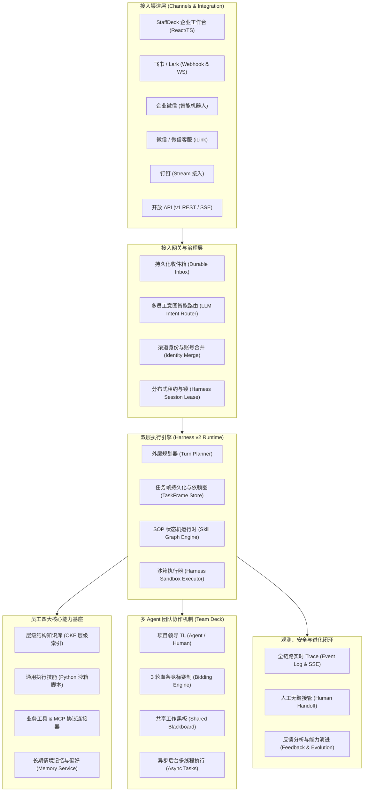
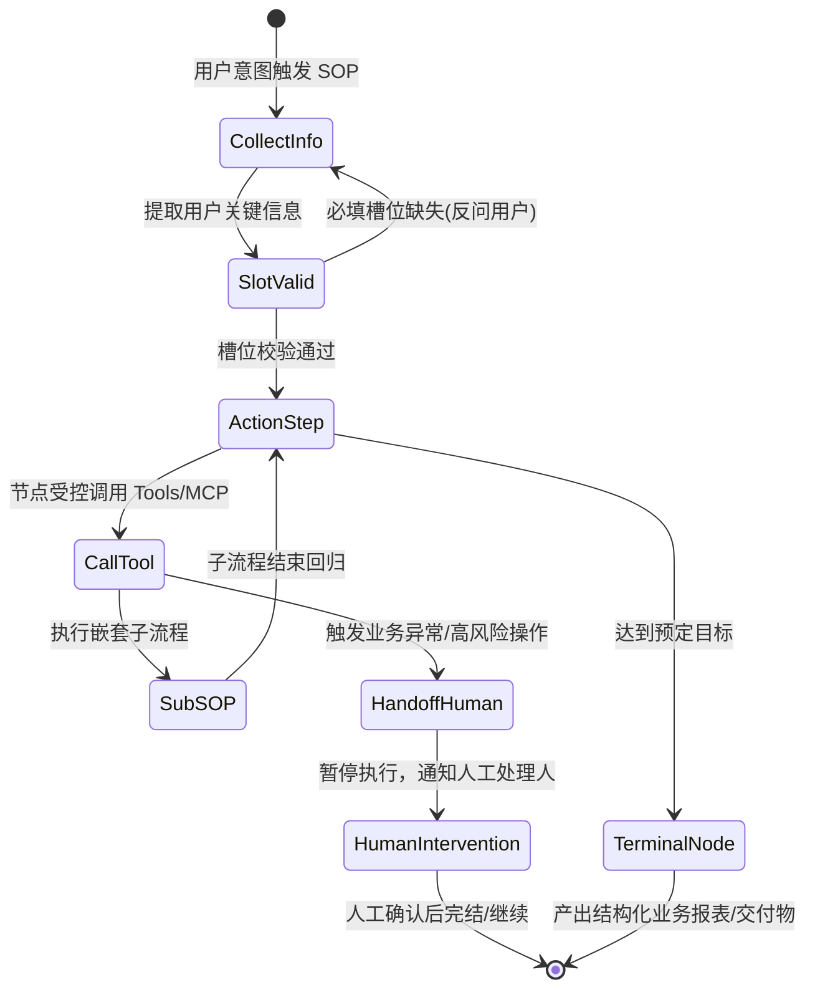
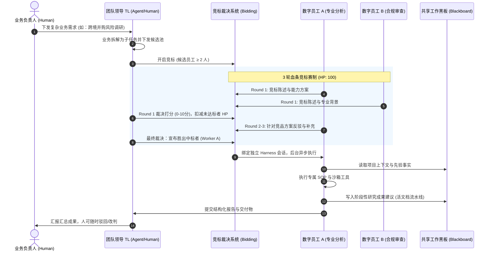

# HCH Staff Hub · 企业级数字员工中枢与实践指南

---

## 目录

- [一、 什么是真正的“数字员工”？](#一-什么是真正的数字员工)
  - [1.1 概念代际跃迁：Chatbot → Agent → 数字员工](#11-概念代际跃迁chatbot--agent--数字员工)
  - [1.2 数字员工的四大核心支柱](#12-数字员工的四大核心支柱)
- [二、 StaffDeck 项目核心架构与实现逻辑剖析](#二-staffdeck-项目核心架构与实现逻辑剖析)
  - [2.1 系统全景架构图](#21-系统全景架构图)
  - [2.2 核心执行引擎：Harness v2 与 TaskFrame 状态调度](#22-核心执行引擎harness-v2-与-taskframe-状态调度)
  - [2.3 状态机驱动的流程型技能（SOP Runtime）](#23-状态机驱动的流程型技能sop-runtime)
  - [2.4 文档结构感知的知识体系（OKF 组织架构）](#24-文档结构感知的知识体系okf-组织架构)
  - [2.5 多 Agent 团队协同：TL 领导、3 轮竞标赛制与共享黑板](#25-多-agent-团队协同tl-领导3-轮竞标赛制与共享黑板)
  - [2.6 企业级全渠道接入与智能路由闭环](#26-企业级全渠道接入与智能路由闭环)
  - [2.7 可靠性与安全治理（HITL、沙箱与全链路观测）](#27-可靠性与安全治理hitl沙箱与全链路观测)
- [三、 这类数字员工的整体工程化实现思路](#三-这类数字员工的整体工程化实现思路)
  - [3.1 身份与画像层（Identity & Persona）](#31-身份与画像层identity--persona)
  - [3.2 规划调度与任务分解层（Planner & Task Frames）](#32-规划调度与任务分解层planner--task-frames)
  - [3.3 业务确定性与流程约束层（Finite State Machine SOP）](#33-业务确定性与流程约束层finite-state-machine-sop)
  - [3.4 感知与环境交互层（Hierarchical RAG & Tools Sandbox）](#34-感知与环境交互层hierarchical-rag--tools-sandbox)
  - [3.5 组织协同与记忆进化层（Multi-Agent Team & Evolution）](#35-组织协同与记忆进化层multi-agent-team--evolution)
- [四、 企业部署数字员工的核心价值点](#四-企业部署数字员工的核心价值点)
  - [4.1 隐性经验显性化：沉淀为高流动性数字资产](#41-隐性经验显性化沉淀为高流动性数字资产)
  - [4.2 突破大模型幻觉：通过状态机实现“确定性交付”](#42-突破大模型幻觉通过状态机实现确定性交付)
  - [4.3 打通业务孤岛：从“动嘴聊天”到“动手干活”](#43-打通业务孤岛从动嘴聊天到动手干活)
  - [4.4 弹性的人机协作（HITL）：兼顾效率与业务风险兜底](#44-弹性的人机协作hitl兼顾效率与业务风险兜底)
  - [4.5 边干边学的飞轮效应：全链路 Trace 驱动组织持续演进](#45-边干边学的飞轮效应全链路-trace-驱动组织持续演进)
- [五、 项目工程结构与关键模块索引](#五-项目工程结构与关键模块索引)

---

## 一、 什么是真正的“数字员工”？

### 1.1 概念代际跃迁：Chatbot → Agent → 数字员工

在企业智能化演化进程中，技术形态经历了三次跃迁：

| 维度 | 智能问答机器人 (Chatbot) | 通用智能体 (AI Agent) | 企业数字员工 (Digital Employee) |
| :--- | :--- | :--- | :--- |
| **工作形态** | 被动响应单轮/简短多轮检索 | 自由发散，自主规划与工具调用 | **拥有明确岗位职责、工号、业务 SOP 与权限边界** |
| **流程控制** | 无流程，仅基于相似度匹对 | 概率性黑盒，依赖 Prompt 约束易跑偏 | **强约束有向图/有限状态机，具备分支、回退与槽位校验** |
| **工具能力** | 无或仅支持少量内置插件 | 动态 ReAct，工具调用顺序不可预测 | **沙箱隔离的执行环境（Harness）、MCP 协议、带审批事务** |
| **协同模式** | 点对点单人使用 | 单打独斗，难以团队并行分工 | **多 Agent 竞标协作、黑板共享记忆、TL（项目领导）分发验收** |
| **业务交付** | 生成一段文本建议 | 尝试生成中间成果，无法承诺质量 | **端到端生产结构化业务产物（Artifacts），承诺交付质量** |
| **兜底机制** | 无法回答时提示无答案 | 强行幻觉生成，或死循环报错 | **HITL（Human-in-the-Loop）人工无缝接管，状态保活可逆** |

### 1.2 数字员工的四大核心支柱

1. **职业化身份（Professional Persona & Identity）**：不仅仅是 System Prompt，而是包含了岗位定位、权限范围、沟通语气、负责业务域与工作台权限的完整组织画像。
2. **确定性执行（Deterministic SOP State-Machine）**：大语言模型具备创造力，但企业交付需要确定性。通过状态机将非结构化经验固化为图节点，严格控制步骤流转。
3. **安全物理操作能力（Safe Environmental Harness）**：具备虚拟文件系统、受限进程执行、HTTP API 鉴权调用以及 MCP（Model Context Protocol）扩展，能在真实系统打单、查数、发邮件。
4. **组织协同与自我进化（Team Synergy & Evolutionary Feedback）**：支持多数字员工分工、团队共享黑板、全链路可观测 Trace，并利用用户反馈与运行日志驱动 SOP 和 Prompt 持续迭代。

---

## 二、 StaffDeck 项目核心架构与实现逻辑剖析

`staff_deck/StaffDeck` 是一套由面壁智能、东北大学、清华大学 THUNLP 实验室及 OpenBMB 联合研发的开源企业级数字员工构建与管理平台。其架构设计具备极高的工程参考价值。

### 2.1 系统全景架构图



---

### 2.2 核心执行引擎：Harness v2 与 TaskFrame 状态调度

StaffDeck 舍弃了脆弱的单轮 ReAct 提示词循环，构建了生产级的 **Harness v2 引擎**（位于 `backend/app/core/harness_v2_engine.py`）：

1. **外层规划与拆解（TurnPlanner）**：
   - 用户发送一条自然语言需求，Planner 结合对话上下文、历史记忆、可用 SOP 列表，生成结构化的执行计划 `TurnPlan`。
   - 复杂需求会被解构为多个有依赖关系的 **TaskFrame（任务帧）**，支持串行、并行或等待依赖解除。
2. **任务帧的持久化与状态转移（TaskFrameStore）**：
   - 任务帧具备独立生命周期：`pending` → `running` → `blocked`（等待前置依赖）→ `completed` / `failed` / `handoff`。
   - 严格的会话互斥锁（`acquire_harness_session`）和并发租约（`HarnessSessionLease`），彻底杜绝重复提交与竞态冲突。
3. **动作配额与防御机制（Action Budget & Replay）**：
   - 单轮交互严格限定最大动作次数（默认 32 次，上限 100 次），超出自动保存状态并进入 `deferred`，防止大模型陷入无限死循环或高额 Token 消耗。
   - 内置幂等键匹配与消息重放机制（Replay），网络抖动时无损自愈。

---

### 2.3 状态机驱动的流程型技能（SOP Runtime）

传统 Agent 最大的痛点是“容易跑偏”，StaffDeck 通过 **SOP 状态机**（位于 `backend/app/skills/`）解决了这一难题：



- **图节点类型丰富**：
  - `collect_info`：信息收集与槽位填充（Slot Filling），支持校验规则和缺失主动追问；
  - `action`：动作执行节点，严格限定本节点可见的工具集（`capability_refs`），杜绝工具误用；
  - `sub_sop`：子 SOP 嵌套调用，实现复杂业务流程的模块化复用；
  - `handoff`：人工干预节点，发生高危操作或业务规则未命中时无缝转人。
- **动态自然语言提炼（Skill Distiller）**：
  - 业务专家无需写代码，直接与平台对话或提供案例文本，提炼引擎自动将其解构为有向无环图（DAG），并以可视化的拖拽节点呈现供二次修订。

---

### 2.4 文档结构感知的知识体系（OKF 组织架构）

传统的朴素 RAG（Naive RAG）常常将长文档切成固定长度的碎片（Chunk），导致语义割裂、指代丢失。StaffDeck 研发了 **OKF（Open Knowledge Format）层级知识架构**（位于 `backend/app/knowledge/okf.py`）：

1. **层级结构感知**：
   - 提取文档的目录树、章节、页面、段落与摘要卡片，构建可导航索引。
   - 检索时遵循员工的“思考链路”：**先判断信息属于哪个文档/章节，再下钻定位具体的段落与原子规则**。
2. **知识分桶与精准路由**：
   - 支持知识库建立多个业务分桶（Buckets），例如“财务规范桶”、“退换货规则桶”。
   - SOP 节点可声明绑定的专属知识桶，实现**定向检索**，信噪比提升数倍。
3. **严格溯源与防幻觉引用（Atomic Citations）**：
   - 检索结果回填时携带精确到源文档、章节与字符区间的原子标记。
   - 最终呈现给用户的回答不仅流式输出，还在元数据中携带带引证角标（`[1] 规范第3.2条`），每一句话均可查证。

---

### 2.5 多 Agent 团队协同：TL 领导、3 轮竞标赛制与共享黑板

单打独斗的 Agent 无法应对复杂的企业大项目。StaffDeck 实现了业界罕见的**多 Agent 团队协作体系**（详见 `design-multi-agent-team-decisions.md` 与 `backend/app/teams/`）：



- **TL 角色（Team Leader）**：由经验最丰富的 Agent 扮演，负责拆解任务、评估候选人、组织竞标和最终验收，人类控制台全量兜底。
- **3 轮血条竞标制（HP-based Bidding）**：
  - 任务不下发给唯一人员时，多名候选员工参与方案竞标。
  - 每轮打分（0-10 分），扣减对应生命值（HP = 100 - $\sum (10 - 得分) \times 3$），归零者出局。这保证了任务分工有依据、过程全审计、成本完全可控。
- **团队共享黑板（Shared Blackboard）**：
  - 解决多 Agent 协同中的“信息孤岛”与“上下文爆炸”。
  - 实行轻量级入库流水线：解析 → 去重合并 → 结构化写入 → 引用回链。成员只读取 Top-K 精炼事实，避免上下文污染。

---

### 2.6 企业级全渠道接入与智能路由闭环

数字员工必须无缝融入企业现有办公环境。StaffDeck 的 `channels` 模块提供了极具实用性的生产级设计：

- **多端原生打通**：
  - **飞书 (Feishu/Lark)**：支持机器人长连接 WebSocket 与事件订阅，富文本卡片排版。
  - **企业微信 (WeCom)**：支持智能机器人 WS 长连接与 Markdown 渲染。
  - **微信个人号 (WeChat iLink 协议)**：扫码即用，支持私聊与群聊。
  - **微信客服 (WeChat KF) & 钉钉 (DingTalk)**：客户服务与协同群通知。
- **意图自动分发路由（Service Auto-route）**：
  - 一个企业 IM 入口挂载多名不同职责的数字员工（如：报销助手、法务初审员、IT运维员）。
  - 用户在群里或单聊发消息时，网关通过轻量级 LLM 快速分类意图，自动分发给最匹配的员工。
- **会话粘性保护（Session Stickiness）**：
  - 若当前员工正在执行多步 SOP 或刚进入人工接管状态，系统自动提高意图切换门槛，防止用户回答上下文被其他员工误拦截。
- **跨平台身份合并（Identity Binding）**：
  - 外部渠道用户（如微信 openid / 企微 userid）可通过 `/绑定 <code>` 与系统账号关联，打通其在各渠道的个人记忆、权限与历史任务。

---

### 2.7 可靠性与安全治理（HITL、沙箱与全链路观测）

1. **人在回路（HITL, Human-in-the-Loop）**：
   - 任何涉及资金流动、外发公文或高风险操作的节点，强制配置 `handoff` 节点，任务自动挂起并向业务主管发送审批卡片；人工审核通过后一键断点续跑。
2. **执行沙箱（Sandbox & Isolation）**：
   - Python 代码执行与文件读写均限定在独立的工作区（Harness Workspace），严格限制磁盘用量（`max_result_bytes`）与执行超时，阻断恶意命令注入。
3. **全链路可观测 Trace（Observability）**：
   - 系统的每一次思考（Thought）、规划（Planner Decision）、状态流转（State Transition）、知识命中（Citations）与工具调用（Tool Execution）均通过 SSE（Server-Sent Events）和持久化 EventLog 实时流式记录，随时支持回放与合规审计。

---

## 三、 这类数字员工的整体工程化实现思路

如果要从零打造一个工业级、面向企业实际投产的数字员工系统，应遵循以下 **六层标准分层架构**：

```
┌─────────────────────────────────────────────────────────────┐
│ 1. 身份与治理层 (Identity, Roles, Access & Permissions)     │
│    岗位定义 / 工号系统 / 权限范围 / 人设性格 / 访问控制     │
├─────────────────────────────────────────────────────────────┤
│ 2. 交互与渠道网关层 (Omni-channel Inbound/Outbound Gateway) │
│    飞书/企微/微信/钉钉/Web / 幂等防重 / 意图分发 / 身份对齐 │
├─────────────────────────────────────────────────────────────┤
│ 3. 规划与任务编排层 (Turn Planner & TaskFrame DAG)          │
│    意图理解 / 任务拆解 / 依赖拓扑排序 / 动作预算配额控制   │
├─────────────────────────────────────────────────────────────┤
│ 4. 业务确定性执行层 (Finite State Machine SOP Runtime)       │
│    SOP 状态机 / 槽位校验 / 条件分支 / 子流程嵌套 / 人工接管 │
├─────────────────────────────────────────────────────────────┤
│ 5. 环境感知与工具沙箱层 (Context, OKF RAG & Tools Sandbox)   │
│    层级结构知识检索 / MCP 协议 / 安全代码沙箱 / 记忆引擎   │
├─────────────────────────────────────────────────────────────┤
│ 6. 多智能体组织协同与进化层 (Multi-Agent Team & Evolution)   │
│    竞标派工机制 / 团队共享黑板 / 审计 Trace / 持续反思迭代  │
└─────────────────────────────────────────────────────────────┘
```

### 3.1 身份与画像层（Identity & Persona）
- **岗位模型化**：将 Agent 从抽象模型包装为具体岗位（如“初级财务核算员”），明确其职能边界（“只能核查发票真实性，不能发起转账”）。
- **权限与多租户**：基于 RBAC 与租户隔离，员工能力（技能、工具、知识）实行最小权限原则与发布复制机制（广场模板只读，克隆后私有化配置）。

### 3.2 规划调度与任务分解层（Planner & Task Frames）
- **长任务切片**：大模型难以一次性稳定完成跨度数小时的长任务。必须将其切片为若干微任务（TaskFrame），并保存在数据库中。
- **状态持久化与防重**：每一次模型交互前先申请分布式租约（Lease），防止网络断连时造成重复调用；任务状态保存在 DB，支持意外宕机后的断点恢复。

### 3.3 业务确定性与流程约束层（Finite State Machine SOP）
- **非结构化经验转为结构化图**：业务规范通常写在 Word 手册或老员工脑子里。系统需要提供“经验提炼器”，通过引导式问答将规章制度转化为具备节点、边、条件逻辑的有向图。
- **强约束执行**：在每一个节点，大模型只能在当前节点所赋予的指令、槽位和工具权限内行动，越界行为在运行时被直接拦截。

### 3.4 感知与环境交互层（Hierarchical RAG & Tools Sandbox）
- **结构化导航检索**：拒绝粗暴向量匹配，建立具备元数据、章节树的文档知识图谱，通过两阶段（粗筛分桶定位 → 细粒度段落精准比对）提供百分之百可靠的引用。
- **标准化工具协议**：全面兼容 **MCP（Model Context Protocol）** 与 OpenAPI 规范，让数字员工通过配置即可调度企业现有的 ERP、CRM、OA 接口。

### 3.5 组织协同与记忆进化层（Multi-Agent Team & Evolution）
- **合理分工而非单一全能**：复杂业务必须拆解给垂直员工，配合专职 Team Leader 协调。
- **数据飞轮闭环**：记录用户给出的好评（Thumbs-up）、差评（Thumbs-down）和纠错文本，离线演化任务（Evolution Worker）据此自动提出 SOP 节点提示词改进或知识库补全建议。

---

## 四、 企业部署数字员工的核心价值点

企业引入类似 StaffDeck 的数字员工平台，绝非仅仅是为了“尝鲜 AI”，而是着眼于重塑组织的生产力基础设施：

### 4.1 隐性经验显性化：沉淀为高流动性数字资产
- **痛点**：传统企业中，核心业务逻辑和专家判断标准散落在老员工的口口相传中；人员离职或轮岗往往导致业务中断与经验流失。
- **价值**：数字员工平台通过自然语言提炼工具，把老员工的判断标准、排错经验与沟通话术，固化为**可视、可审、可复用、可传承的结构化 SOP 状态机**。个人的知识资产真正沉淀为组织的数字生产力。

### 4.2 突破大模型幻觉：通过状态机实现“确定性交付”
- **痛点**：通识大语言模型天生具备概率性和发散性，在企业财务、合规、合同审查等严肃场景下，哪怕 1% 的幻觉失误都会带来灾难性后果。
- **价值**：数字员工引入状态机强约束、严格槽位校验与层级知识溯源。每一步必须完成前置校验才允许流转，每一个结论都提供原文定位，彻底消除 AI 在严肃业务场景中的失控风险。

### 4.3 打通业务孤岛：从“动嘴聊天”到“动手干活”
- **痛点**：以往的 AI 仅停留在问答咨询（“告诉人该怎么做”），人依然需要在 ERP、CRM、OA、邮件等几十个互不连通的异构系统中繁琐操作。
- **价值**：数字员工不仅有大脑（LLM），更有双手（Harness 物理沙箱、HTTP API 与 MCP 连接器）。它可以跨系统读取数据、核验合同、生成报表、提交审批并直接推送给业务人员，实现端到端的闭环业务自动化。

### 4.4 弹性的人机协作（HITL）：兼顾效率与业务风险兜底
- **痛点**：要么完全靠人，成本高且无法 7×24 小时响应；要么盲目全自动化，面临业务决策失误无人背书的风险。
- **价值**：通过“人机回路（HITL）”机制，数字员工自主承担 80%~90% 的重复性标准任务；在遇到未知边缘用例（Edge Cases）或高风险红线时，主动触发 Handoff 无缝呼叫人类主管，兼具极致效率与绝对安全性。

### 4.5 边干边学的飞轮效应：全链路 Trace 驱动组织持续演进
- **痛点**：传统软件系统上线后升级迭代周期长、成本高，无法感知实际使用过程中的微小卡点。
- **价值**：全链路运行记录（Event Trace）让每一次交互成为组织改进的养料。通过用户点赞、点踩和纠偏反馈，系统自动分析瓶颈，辅助业务人员一键升级 SOP 节点与知识库，使数字员工“越用越聪明”。

---

## 五、 项目工程结构与关键模块索引

本项目核心代码位于 `staff_deck/StaffDeck`，主要模块架构梳理如下：

```text
staff_deck/StaffDeck/
├── backend/
│   ├── app/
│   │   ├── core/                  # 执行内核: Harness v2、AgentLoop、TaskFrame、状态机调度
│   │   │   ├── agent_loop.py      # 会话单轮执行主循环
│   │   │   ├── harness_v2_engine.py # 核心编排引擎 (规划/依赖解析/执行)
│   │   │   ├── turn_planner.py    # 意图理解与任务帧规划器
│   │   │   └── human_handoff_service.py # 人工接管调度机制
│   │   ├── harness/               # 沙箱执行基座 (受限命令、文件操作、产物管理)
│   │   ├── skills/                # SOP 技能体系: 状态机结构、提炼器 (Distiller)、反射
│   │   ├── teams/                 # 多 Agent 团队协作: TL 调度、3轮竞标赛制、共享黑板
│   │   ├── knowledge/             # OKF 层级结构感知知识库、分桶与原子引证 (Citations)
│   │   ├── channels/              # 企业渠道适配层: 飞书、企微、微信、钉钉、意图分发
│   │   ├── tools/                 # 工具调用引擎、HTTP API 客户端、MCP 协议连接器
│   │   ├── memory/                # 长期情境记忆、用户偏好捕捉服务
│   │   ├── feedback/              # 用户反馈收集与分析
│   │   ├── evolution/             # 技能持续演化与自动改进引擎
│   │   └── observability/         # 全链路 Spans 追踪与 Event Log 审计
│   └── tests/                     # 单元与集成测试用例库
│
├── frontend-enterprise/           # 企业级现代控制台 (React 18 + TypeScript + Vite)
│   ├── src/
│   │   ├── pages/
│   │   │   ├── EmployeeGalleryPage.tsx # 数字员工广场 (可复用模板库)
│   │   │   ├── AgentsPage.tsx          # 员工管理与画像配置
│   │   │   ├── DistillPage.tsx         # SOP 自然语言提炼与状态机可视化编排
│   │   │   ├── TeamsPage.tsx           # 多 Agent 团队管理与协作看板
│   │   │   ├── KnowledgePage.tsx       # OKF 知识库管理与层级检索调试
│   │   │   ├── ChannelsPage.tsx        # 企微/飞书/微信渠道接入与绑定
│   │   │   └── TracesPage.tsx          # 全链路思考与执行记录观测台
│   │   └── components/                 # 高度复用的现代化组件库
│
└── packaging/                     # 跨平台客户端打包资源 (macOS / Linux / Windows)
```

---

> 💡 **总结**：数字员工不是简单的聊天玩具，而是企业的**新一代数字化劳动力基础设施**。通过 `staff_deck` 项目所呈现的“**状态机强约束 + 任务帧调度 + 结构感知检索 + 物理沙箱执行 + 多智能体竞标 + 全链路安全闭环**”工程实践，企业能够真正将人工智能转化为可信赖、可审计、可持续迭代的组织生产力。
